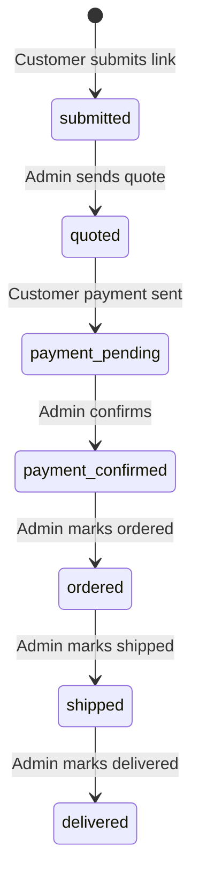

# Suuqsade — Project Context

> **Purpose:** Master planning doc for Suuqsade. This folder holds context and brand assets only — **not** the Laravel or Flutter codebases.
>
> **Copy this file** into each code project when you create them:
> - `../Suuqsade-API/CONTEXT.md` (Laravel)
> - `../Suuqsade-App/CONTEXT.md` (Flutter)
>
> **Last updated:** 2026-07-06

---

## 1. What We're Building

**Suuqsade** is a proxy-shopping app for Somalia/Somaliland. Customers paste a Shein or Amazon product link, Suuqsade staff quote a total (item + service fee + shipping/customs), the customer pays via **ZAAD** or **eDahab** mobile money, and Suuqsade purchases abroad and delivers locally.

**Positioning:** *"The trusted way to shop Shein and Amazon from Somalia/Somaliland."*

**Revenue model:** `(service_fee_pct × item_cost) + flat_shipping_fee` per order. No subscription, no ads.

---

## 2. Project Locations (separate folders)

Do **not** put Laravel and Flutter inside this directory. Use three sibling folders:

```
MurabacApps/
├── Suuqsade/              ← THIS FOLDER: CONTEXT.md + brand-assets/ only
│   ├── CONTEXT.md
│   └── brand-assets/
│       ├── logo.png
│       └── icon.png
│
├── Suuqsade-API/          ← Laravel 11 (REST API + admin dashboard)
│   └── CONTEXT.md         ← copy of this file
│
└── Suuqsade-App/          ← Flutter customer app (iOS + Android)
    └── CONTEXT.md         ← copy of this file
```

| Project | Path | Stack |
|---------|------|-------|
| Planning & assets | `MurabacApps/Suuqsade/` | Markdown + brand files |
| Backend + admin | `MurabacApps/Suuqsade-API/` | Laravel, Sanctum, Livewire, Blade, **MySQL** |
| Customer app | `MurabacApps/Suuqsade-App/` | Flutter |

---

## 3. Locked Decisions

| Topic | Decision |
|-------|----------|
| Database | **MySQL** |
| Currency | **USD only** (display `$X.XX` everywhere) |
| Phone auth (MVP) | **Fixed OTP** — no SMS provider yet. Code: `123456` (configurable via env) |
| Default service fee | **10%** |
| Default shipping fee | **TBD** — set in admin Settings at launch; seed placeholder `$15.00` until confirmed |
| Merchant number | **Single number** for both ZAAD and eDahab (placeholder: `0000000` until real number) |
| USSD format | `*883*{merchant}*{amount}#` — same merchant number for both providers |
| Supported link domains (MVP) | **Shein** + **Amazon** only — Alibaba, Trendyol added later |
| Brand assets | Live in **`Suuqsade/brand-assets/`** (this repo) |
| Legacy Next.js app | **Removed** — fresh start on Laravel + Flutter |

### Allowed product link domains (MVP validation)

Validate host contains one of:

- `shein.com`, `m.shein.com`, `api-shein.shein.com` (adjust as needed)
- `amazon.com`, `amazon.co.uk`, `amazon.ae`, etc. (any `amazon.*` TLD)

Reject all other domains with a clear error: *"Only Shein and Amazon links are supported for now."*

### Default settings (seed in Laravel)

| Key | Value |
|-----|-------|
| `default_service_fee_pct` | `10` |
| `default_shipping_fee` | `15.00` |
| `merchant_number` | `0000000` |
| `quote_response_hours` | `24` |
| `payment_confirm_minutes` | `30` |

> Use one `merchant_number` key (not separate ZAAD/eDahab keys) since both share the same number for MVP.

### Fixed OTP (Laravel `.env`)

```env
OTP_FIXED_CODE=123456
OTP_BYPASS=true
```

- `POST /api/auth/send-otp` — accepts phone, always succeeds (no SMS sent)
- `POST /api/auth/verify-otp` — accepts phone + code; only `123456` passes in MVP

---

## 4. Branding

### Assets (`Suuqsade/brand-assets/`)

| File | Use |
|------|-----|
| `logo.png` | Full logo (current) |
| `icon.png` | App icon / favicon (current) |
| `logo_purple.pdf` | Full logo on light backgrounds *(add when available)* |
| `logo_white.jpeg` | Full logo on purple/dark backgrounds *(add when available)* |
| `icon_purple.pdf` | Mark on white rounded square *(add when available)* |
| `icon_white.pdf` | Mark on purple splash *(add when available)* |

### Colors

| Role | Hex | Usage |
|------|-----|-------|
| Primary (brand purple) | `#431475` | Primary CTAs, active nav, headers, quote total |
| Base | `#FFFFFF` | Backgrounds, cards |

**Rule:** Purple is for actions and navigation only. Status pills use their own colors (below).

### Status pill colors

| Status | Color |
|--------|-------|
| Submitted | gray |
| Quoted | amber |
| Payment pending | amber |
| Payment confirmed | teal |
| Ordered | blue |
| Shipped | blue |
| Delivered | green |
| Cancelled | gray |

### Splash screen

Purple background (`#431475`) + white icon/logo centered.

---

## 5. Architecture

```
┌─────────────────────┐         ┌──────────────────────────────────┐
│  Flutter            │  HTTPS  │  Laravel (Suuqsade-API/)         │
│  Suuqsade-App/      │ ──────► │  /api/*     → Sanctum tokens     │
│  iOS + Android      │         │  /admin/*   → session auth       │
└─────────────────────┘         │  Livewire + Blade admin UI       │
                                └──────────────────────────────────┘
                                           │
                                           ▼
                                         MySQL
                                    Firebase (FCM push)
```

### Auth guards

| Guard | Driver | Table | Used by |
|-------|--------|-------|---------|
| `sanctum` | API tokens | `users` | Flutter app |
| `web` (admin) | Session | `admins` | Blade/Livewire dashboard |

- Customer: phone number + fixed OTP → Sanctum token
- Admin: email + password → session (`auth:admin`)
- **Policies** (e.g. `OrderPolicy`): customers see only their own orders

### Real-time (MVP)

| Client | Approach |
|--------|----------|
| Admin dashboard | Livewire `wire:poll` |
| Flutter app | Poll every 15–30s on open order screens |
| Push | FCM from Laravel on every status change |

---

## 6. Database Schema (MySQL)

Laravel migrations. Auto-increment `bigint` PKs.

### `users`

| Field | Type | Notes |
|-------|------|-------|
| id | bigint PK | |
| phone_number | string, unique | ZAAD/eDahab matching |
| name | string | |
| language | string | `so` / `en` / `ar` |
| delivery_address | string, nullable | |

### `orders`

| Field | Type | Notes |
|-------|------|-------|
| id | bigint PK | |
| user_id | bigint FK → users | |
| product_link | text | Shein or Amazon URL only (MVP) |
| product_note | text, nullable | |
| status | enum | see below |
| batch_id | string, nullable | multi-link submits |
| item_cost | decimal(10,2), nullable | USD |
| service_fee_pct | decimal(5,2), nullable | default 10 |
| shipping_fee | decimal(10,2), nullable | USD |
| total_amount | decimal(10,2), nullable | USD, computed |
| delivery_address | string, nullable | |
| tracking_note | text, nullable | |

**Status enum:** `submitted`, `quoted`, `payment_pending`, `payment_confirmed`, `ordered`, `shipped`, `delivered`, `cancelled`

### `order_status_history`

| Field | Type | Notes |
|-------|------|-------|
| id | bigint PK | |
| order_id | bigint FK → orders | |
| status | enum | |
| changed_by | bigint FK → admins, nullable | |
| created_at | timestamp | no `updated_at` |

### `payments`

| Field | Type | Notes |
|-------|------|-------|
| id | bigint PK | |
| order_id | bigint FK → orders | |
| amount | decimal(10,2) | USD |
| method | string | `zaad` / `edahab` |
| confirmed_by | bigint FK → admins, nullable | |
| confirmed_at | timestamp, nullable | |

### `admins`

| Field | Type | Notes |
|-------|------|-------|
| id | bigint PK | |
| name | string | |
| email | string, unique | |
| password | string | hashed |
| role | string | `sales` / `super_admin` |

### `trending_items` (v2)

Deferred for post-MVP.

### `reviews` (post-MVP)

Deferred.

### `settings` (key-value)

| Field | Type |
|-------|------|
| key | string PK |
| value | string |

### Relationships

```
User    hasMany Order
Order   belongsTo User; hasMany OrderStatusHistory, Payment
Admin   confirms payments; changes status history
```

---

## 7. API Endpoints (`Suuqsade-API` — `/api/*`)

Customer routes: `auth:sanctum` unless noted.

### Auth

| Method | Path | Description |
|--------|------|-------------|
| POST | `/api/auth/send-otp` | Accept phone (fixed OTP mode — no SMS) |
| POST | `/api/auth/verify-otp` | Phone + code `123456` → Sanctum token |
| POST | `/api/auth/logout` | Revoke token |
| GET | `/api/user` | Profile |
| PUT | `/api/user` | Update name, language, delivery_address |

### Orders

| Method | Path | Description |
|--------|------|-------------|
| POST | `/api/orders` | Single Shein/Amazon link |
| POST | `/api/orders/batch` | Multiple links, shared `batch_id` |
| GET | `/api/orders` | List (`?filter=all\|active\|delivered`) |
| GET | `/api/orders/{id}` | Detail + status history |
| POST | `/api/orders/{id}/payment-sent` | → `payment_pending` |

### Notifications

| Method | Path | Description |
|--------|------|-------------|
| GET | `/api/notifications` | List |
| POST | `/api/user/fcm-token` | Register device |

### Settings (public)

| Method | Path | Description |
|--------|------|-------------|
| GET | `/api/settings/public` | `merchant_number`, fee defaults |

---

## 8. Admin Routes (`Suuqsade-API` — `/admin/*`)

| Route | Livewire / Blade | Purpose |
|-------|------------------|---------|
| `/admin/login` | Blade | Email/password |
| `/admin/incoming` | `IncomingQueue` | Status `submitted` |
| `/admin/orders/{id}/quote` | `QuoteBuilder` | Send quote (USD) |
| `/admin/payments` | `PaymentConfirmationQueue` | `payment_pending` + poll |
| `/admin/tracking` | `OrderTracking` | Advance status |
| `/admin/settings` | Blade | Fees, merchant number |

### Status transitions

Every change: update order → insert history → notify user → FCM push.

```
submitted → quoted → payment_pending → payment_confirmed → ordered → shipped → delivered
```

---

## 9. Flutter App (`Suuqsade-App`)

### Bottom nav (5 tabs)

`Home` · `My Orders` · `Trending` · `Notifications` · `Profile`

### MVP screens

| Screen | Notes |
|--------|-------|
| Home | Link input, Shein/Amazon only, Submit |
| Order submitted | Confirmation |
| My Orders | Status pills, filters |
| Order Detail | Timeline, USD quote breakdown, Pay now |
| Payment | Amount, merchant #, USSD, "I've sent payment" |
| Notifications | Status messages |
| Profile | Phone, address, language (SO/EN/AR) |
| Multi-order paste | Batch submit |

**Trending tab:** show placeholder / coming soon for MVP, or hide until v2.

### Payment screen copy

- Amount in **USD**
- Merchant: `{merchant_number}` (tap to copy)
- USSD: `*883*{merchant}*{amount}#`
- Works for ZAAD or eDahab (same number)

---

## 10. MVP Checklist

- [ ] Laravel project in `Suuqsade-API/` — migrations, models, Sanctum, Livewire
- [ ] Flutter project in `Suuqsade-App/`
- [ ] Fixed OTP auth
- [ ] Order submit → quote → pay → confirm → track flow
- [ ] Admin queues + settings
- [ ] FCM on status changes
- [ ] Shein/Amazon URL validation only

### Post-MVP

Trending, reviews, admin roles, more retailers, real SMS OTP, separate merchant numbers if needed.

---

## 11. Build Plan (6 weeks — summary)

| Week | Focus |
|------|-------|
| 1 | Laravel setup + migrations + auth; Flutter scaffold; Figma |
| 2 | Order API + admin Livewire components |
| 3 | Flutter core screens + FCM |
| 4 | Admin polish + E2E test |
| 5 | Profile, i18n, branding, error states |
| 6 | Test, deploy API, app store, soft launch |

---

## 12. Environment

### Laravel (`Suuqsade-API/.env`)

```env
DB_CONNECTION=mysql
OTP_FIXED_CODE=123456
OTP_BYPASS=true
# FCM_SERVER_KEY=...
```

### Flutter (`Suuqsade-App`)

- API base URL points to Laravel deploy
- State management: **TBD** (decide before Week 3)
- i18n: `so`, `en`, `ar`

---

## 13. Open Items (minor)

| Item | Status |
|------|--------|
| Default flat shipping fee (USD) | Placeholder `$15.00` — confirm before launch |
| Flutter state management | TBD |
| Hosting target | TBD |
| Real merchant number | Replace `0000000` before go-live |
| Real SMS OTP provider | Replace fixed OTP post-MVP |

---

## 14. Cursor Instructions

**In `Suuqsade-API/`:**
- API for Flutter in `routes/api.php`
- Admin in `routes/web.php` + `app/Livewire/Admin/`
- Validate Shein/Amazon URLs on order create
- All prices in USD
- Fixed OTP only until SMS is wired

**In `Suuqsade-App/`:**
- Point API at Laravel backend URL
- Purple `#431475` for primary actions only
- Copy brand colors/icons from `../Suuqsade/brand-assets/`

**In `Suuqsade/` (this folder):**
- Update this file when decisions change
- Re-copy to API and App folders after updates

---

## 15. Order Status Flow



---

*When this file changes, copy to `../Suuqsade-API/CONTEXT.md` and `../Suuqsade-App/CONTEXT.md`.*
